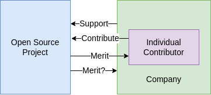

---
date:
  created: 2025-01-30
tags:
  - open-source
categories:
  - Thinkoneering
---

# How do Personal and Company Identities Shape Open Source Contributions?

Imagine that you are a maintainer of a widely used open source project relied upon by developers worldwide.
Being a maintainer means, that you get to decide which contributions by external contributors get accepted.
Now, there are two contributions.
One from an individual contributor and one from a person that you know works for a certain company.
You know that the individual contributor has worked on the code they are contributing in their free time and you really like the quality of their work.
The other contribution is also of high quality.
Would you treat these contributions differently?
Should you?

<!-- more -->

Technically both of these are just persons contributing code.
But can you truly ignore the fact that one contributor belongs to a company, or do you even attribute their contribution primarily to that company?
A recent survey by the Linux Foundation found that organizations contribute 7.7B USD annually to open source projects and that 86% of that is contributed in the form of labor by individuals[@boysel2024OpenSource2024].
I am interested in the role that individual and company identities play in open source contributions.

To explore the topic, I will first provide background on Open Source Software and an overview of identity theory at both individual and collaborative levels.
Then I look at the nature of individual contributions in OSS, their motivations, and the role of community and meritocracy.
In contrast, I will explore how and why companies contribute to OSS and compare this to individual and community contributions.
Comparing these I then identify key challenges and tensions between individual contributors and companies.
Using the previously introduced organizational identity theory, some interesting insights can be gained.
I then want to give some practical examples that I observed working in ROS.

## Context: Open Source Software, Identity Theory

Open source in its basic form means that the source code of a piece of software is available freely for anyone to analyze, modify, or share.
In practice, there are different licenses that are published with the source code, each with somewhat different rights and duties associated to them.
But this is not what I will talk about today.
What makes open source so powerful is that this free access to source code allows for truly open collaboration.
Eric S. Raymond described this in two contrasting models of software development of the "Bazaar" and the "Cathedral".
Here, the Bazaar refers to the way software is developed in open source projects: openly and collaboratively, with many contributors.
The Cathedral model, on the other hand, symbolizes classic software development: closed within commercial development projects by a few experts.
Raymond argues that the Bazaar model is more effective for creating robust and innovative software[@raymondCathedralBazaarMusings2001].

For transparency reasons, I want to declare that my analysis of these topics is influenced primarily by my personal experience in one open source project and that is ROS, the Robot Operating System.
It is an amazing framework for building robots, but its technical details will not be of further relevance for this article.

Before exploring OSS projects further, though, I want to introduce the tool for this exploration: _identity_.
Generally speaking, identity is the relation an entity has to itself[@noonanIdentity2022].
Locke made clear that it is fundamentally consciousness what allows for _personal identity_.
This consciousness can be extended backwards to past actions or thoughts[@lockeEssayConcerningHuman1694,@gordon-rothLockePersonalIdentity2020].
While this is a fundamental building block for identity, it alone will not help explain what I am interested in.

A more modern take is _social identity_.
It is "a person’s sense of who they are based on their group membership(s)"[@turnerSocialComparisonGroup1979].
Knowing this can give people a sense of belonging, purpose, self-worth, and crucially identity.
In practice, these groups can be defined by anything from ethnicity or religion to professional affiliation or musical preference[@turnerSocialComparisonGroup1979,@SocialIdentityTheory2023].
This can also explain aspects of how individuals identities are based on them being employed by a company.
However, I have one last section on corporations in particular.

When companies refer to themselves, it is called _organizational identity_.
Firstly, organizations are more than a collection of individual identities.
French argues that organizations as a whole have morality.
Basically, because they have intentionality and responsibility[@frenchCorporationMoralPerson1979].
When thinking about a company, then it is their capability to make decisions that leads to that intentionality.
A organization needs an identity to make these decisions.
And similarly to how we saw with Locke above, this is based on its own history but also by reference to a self-assigned organization type[@whettenAlbertWhettenRevisited2006].
I think this is very interesting and can be used to explain many phenomena perceived when working in companies.
But for now, this is enough background, and next I want to look at the nature of open source contributions in some more detail.

## Individual Contributions in OSS

Why do individuals contribute to open source?
I think the core motivations are intrinsic.
The inherent passion for programming and development is not to be underestimated.
However, these OSS projects are also communities, and being involved in that can be very motivational.
As we learned from social identity, belonging to a group is an ingredient to one's own identity[@SocialIdentityTheory2023].

Further, extrinsic motivations also play a role.
This includes one's own career advancement, because contribution to open source makes the individual visible and can create a reputation that may be useful when looking for a job.
External recognition can also serve as a more general motivating factor.
Feeling seen as a valuable contributor increases one's self-worth.

I think this quote summarizes it well

> \[Motivations include\] both extrinsic, enhancing reputation and developing human capital and social networks; and intrinsic, satisfying psychological needs, pleasure, and a sense of social belonging.[@benklerCommonsBasedStrategiesProblems2004]

While I talked about recognition as one source of motivation, recognition does also serve a different purpose in open source projects: power.
Open source projects are often described as meritocracies.
Interestingly, the term was popularized by a dystopian book called _The rise of the meritocracy_ by Michael Young[@youngRiseMeritocracy1958].
In it, the envisioned future society based on meritocracy has many problems, maybe the biggest being a lack of social mobility.
Careful analysis can disprove the negative effects of meritocracy that Young envisioned in 1958[@allenMichaelYoungsRise2011].
So today, meritocracy is generally considered a desirable political system.

Political systems look at how power is distributed, and in meritocracy the idea is that power is awarded based on merit.
It is that merit that individual developers accumulate by contributing to open source projects.
With that, they will gain influence in the project's hierarchy.
This generally allows for more technically informed decisions, assuming that those that contributed to a project a lot also have a clear idea about its inner workings.
There is an obvious contrast to how power is organized in companies, where decisions are generally by those that are hierarchically entitled to make them, but may not necessarily have the relevant technical insights.
This is not to say that in companies no technically informed decisions are made, but that the role and potential influence of individual engineers is different to that in open source projects.
In my opinion and experience, this is also a reason people contribute to open source projects.

Note that arguments can be made that hierarchical structures in the governance of many OSS projects may also bring them closer to rigid structures of companies[@schrapeOpenSourceCommunities2018].
However, this does not match my personal anecdotal evidence from working in ROS.
While this may be different from project to project, the topic is generally of course not a precise binary difference.
But despite differences in the ways decisions are made, companies also have a lot of reasons to engage in open source, and this is what I want to look at next.

## Company Contributions to OSS

Why are companies interested in open source?
On a first analysis it may seem counterintuitive for a company that is generally interested in financial success to have in interest in improving software that must ultimately be and remain free to use and that is further shared with all of their direct competitors.
But it has been observed by many, that while historically it was individuals that primarily contributed to open source it is now companies[@raymondCathedralBazaarMusings2001,@schrapeOpenSourceCommunities2018,@EvolutionOpenSource].
Why is that?

A first motivation is _Quality_.
Eric S. Raymond introduced Linus's law as "given enough eyeballs, all bugs are shallow" which is named after Linus Torvalds[@raymondCathedralBazaarMusings2001].
And this certainly makes sense, that if more people look at a given code, the better its quality will eventually be.
I would argue that this can also be attributed to how open source communities work.
As anyone having worked in big development projects knows, having too many engineers will not automatically produce quality software.
However, I argue that it is also the organization of a diverse bunch of intrinsically motivated engineers in meritocratic structures that leads to the constant improvement of software quality.
But the promise of quality cannot be the only motivation for companies investing that 7.7B USD annually in open source projects[@boysel2024OpenSource2024].

It gets really interesting to look at _Innovation_.
Historically, it would be considered an inherent task of a company to create innovation themselves.
However, the ever increasing advancement of the technical state of the art can make it challenging to keep up with that, let alone extending it through innovation.
OSS helps here by leveling the playing field.
When the state of the art is available for everyone to use, it is not necessary to reinvent the wheel.
Individual companies can focus their development teams to invest on what they think is innovative.
This is also what makes these projects hugely interesting for smaller companies, because the described effects are even more pronounced for them.

If companies build their innovatability, and therefore sometimes their whole business model, on open source software, it is natural that they have an interest in the welfare of the associated OSS project.
That is why many companies support such projects monetarily.
However, this dependence also motivates the desire for influence.
Long-term strategic influence is often granted by the OSS project in return for the financial support.
For short-term technical influence, it is often also in the interest of companies to pay their developers to actively contribute to the software.
This influence can also be more targeted, but often requires building up contributors with the necessary influence long term[@ParticipatingOpenSource].
A very interesting point in the survey by the Linux Foundation was that many respondents were relatively more knowledgeable about the size of their financial contributions than about the contribution through labour[@boysel2024OpenSource2024].

## Challenges and Tensions

At first sight, this seems like a mutually beneficial relationship: engineers want to contribute, companies let them do it and gain influence.
However, this also bears challenges.
For example, it is not easy for companies to know which influence they want or need in the long term.
It can also be challenging for an engineer that sees the requirement for such influence to convince their employer to take the necessary investments.
Here, it is interesting to think about to which identity this merit will then be linked: that of the company or that of the individual engineer?
From my experience, it is often the individual, up to a degree where these people take their merit with them when they change jobs.
This is obviously not in the interest of companies having specifically invested in that person and project.
However, through careful long-term OSS strategy work, it is also very much feasible for companies to accumulate merit and not lose it on personnel changes.

Another very real challenge for individual contributors and maintainers highlighted by Nadia Eghbal and others is that of burnout[@nadiaeghbalWorkingPublicMaking2020,@WhyContributingOpen].
This phenomenon may well be inherent to insufficient governance in OSS project management.
Especially at risk of burnout ate maintainers that fill positions that are very tailored to their person and/or skillset.
Effective governance would define processes to distribute their workload to more people or find people to step in in case they need to take a break or attend to personal duties.
Often times, it also simply unlikely to find someone else taking over that person's position.
If they are doing a good job, no one will contest their position, and if their workload is perceived as basically more than a fulltime job, this gets even less likely.
The relation to company identities is weaker here: The described phenomenon usually applies to individuals where their identity is a lot more relevant to their success than the one of their company, if that is even relevant at all.
However, it bears a tragic reality that many other companies are depending on that person's work without being able to ensure their proper working conditions.
Now, I think we can look more closely at these challenges with some more identity theory.

## Organizational Identity Theory Applied to OSS

An interesting aspect in the Whetten article is that organizational identities are more fluid than personal identities.
That is at least what I take from it, and it makes sense, because as a person I rely on that identity much more and it can cause a serious crisis if it is challenged or changes too extremely.
However, identities of companies will be challenged more frequently and are often only properly defined in events of change or crisis[@whettenAlbertWhettenRevisited2006].
This explains how merit in OSS is more strongly attributed to individual identities if they are more constant.
However, it is also visible that a necessary condition for allocation of merit to corporations requires a strong organizational identity.
This is of course also influenced by the individual identities of engineers being affiliated with those corporations in public contexts like OSS projects.

Another interesting link can be drawn from the argument of French for the morality of corporations[@frenchCorporationMoralPerson1979].
If someone claims that companies using open source software ought to give back contributions in return, that is a moral statement.
This would gain or lose validity based on the attribution of morality to companies.
Before reading French's article, I would not have personally assumed companies to be moral.
Furthermore, I also did not think of morality as very relevant in the context of companies contributing (or not) to open source.
However, I think we can learn something from applying French's argument to open source:
The argument is based on intentionality and responsibility.
This makes intuitive sense to me, that I can only be morally accountable for actions that I did both intentionally and are responsible for.
When we apply this to a company that intends to use open source software and is responsible for that usage, only then would they be morally obliged to contribute back.
What happens without intentionality is interesting: If the organization did not intend to use that open source code, for example because one employee decided to use it without getting proper approval, it does not necessarily entail the moral need for a decision on company level to contribute back.
And for responsibility, we could consider the example of a company not being responsible for their usage of a given open source software, maybe because they are forced to use it by another business partner, then I can also follow the argument that they would not be morally obliged to contribute back.
It is very fascinating to me how clearly attributes like morality that are well understood for individual agents can be applied to organizations.
Here, open source works as a great example that helps to clarify these ideas.

## Case Studies and Examples

To make these points even more graspable, I would like to add some practical examples that I observed in ROS.
One aspect that I don't know how unique it is in comparison to other projects is the prevelance of small companies or contributors that have their own freelance business.
This serves on the one hand as an interesting lens on the morality of companies, which is even easier to believe the closer a company is to a single individual.
On the other hand, it also highlights the importance of individual contributors in OSS.
Many of these companies are not only small but also constantly changing, which makes the people a more constant aspect of the community than their companies.
Here, I have an observation that would disagree with Schrape writing that "companies and other organizations are able to bring in their resources more continuously and consistently than individual contributors"[@schrapeOpenSourceCommunities2018].
In ROS, and particularly in Nav2, we have witnessed quite a few companies discontinuing their contributions while the involvement of the relevant individuals seem a lot more stable and consistent[@Navigation2WGChanges2021,@Nav2TimeChange2021].

On the relevance and importance of identities for the work in open source, I came across a Stack Overflow discussion, where a person asks whether it would be feasible to contribute everything their company does from one GitHub account[@ContributorContributingCompany].
The consensus of the answers is that this is a bad idea for multiple reasons, one of them being the integral relevance of personal communication in OSS communities.
There is also a nice blog post by Jono Bacon on whether anonymous OSS contributions are a good idea, coming to the conclusion that identities in OSS are important for reasons of meritocracy, accountability, and openness[@AnonymousOpenSource2017].
These are valid points for the relevance of individual identities in open source from very practical perspectives.

However, there is also an interesting example for organizational identities on a level that we did not consider thus far.
That example is interestingly enough the ROS community itself.
We can apply what we learned about the necessity for discussion about an organisational identity and the potential for kickstarting that discussion through big changes and the threat of loss of identity.
The example is, of course, the acquisition of big parts of Open Robotics by Intrinsic in 2022[@AlphabetsIntrinsicAcquires].
This led to many discussions in the ROS community[@QuestionsIntrinsicAcquisition] and ultimately to the foundation of its new governance organization Open Source Robotics Alliance OSRA[@AnnouncingOpenSource].
So I read this as an example for ROS as an organization losing its identity through the Intrinsic acquisition and the subsequent redefinition of its own identity ending in a clearer and better understood identity than it had before.
And only this new identity could have led to the strong stand the OSRA has today.

## Conclusion

The key takeaways that could be useful from this article are:

- __Tension Between Individual and Organizational Merit__: Contributions in open source projects are often tied to individual identities rather than the companies they represent. To utilize this as a company, a strong open source strategy is needed.

- __Meritocracy vs. Hierarchy__: Open source projects often operate as meritocracies, where influence is earned through contributions. However, the project's governance also contains elements of classical hierarchies. This balance is crucial.

- __Dual Motivations for Contributions__: Individuals are driven by both intrinsic factors, such as passion for development and community belonging, and extrinsic factors, like career advancement and reputation. Companies, however, are motivated by goals like quality improvement, innovation, and long-term influence over open source projects.

- __Role of Organizational Identity__: Companies can establish their identity within the open source community through consistent and intentional contributions, which helps build trust and influence over time.

- __Governance Challenges in Open Source__: Burnout among maintainers highlights the need for better governance structures in open source projects, such as processes to distribute workloads and ensure continuity, which may differ significantly from corporate project management practices.

<!-- Abbreviations -->>

*[OSRA]: Open Source Robotics Alliance
*[OSS]: Open Source Software
*[ROS]: Robot Operating System

<!-- Thanks as "orphan footnotes" -->

[^]: Big thanks to Maximilian Roßmann and Sebastian Castro for refining both the content and language - couldn’t have done it without you!
