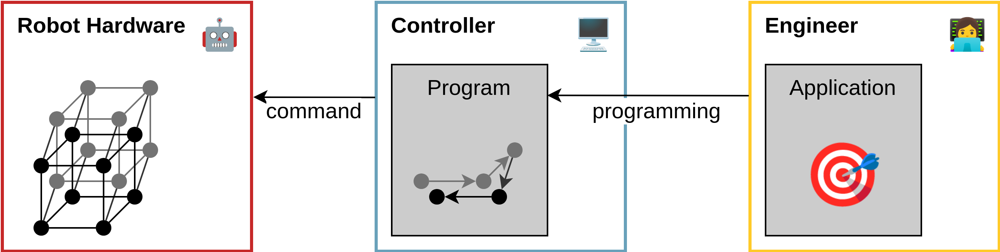
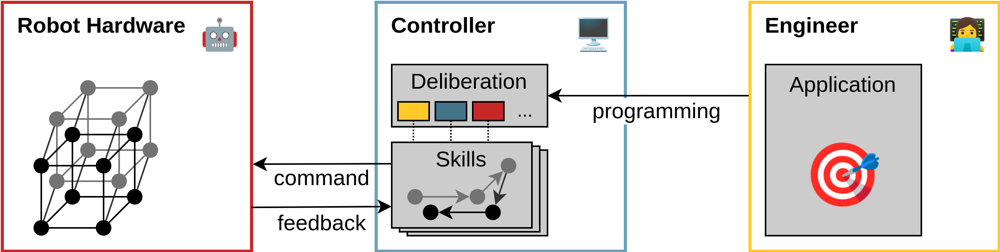
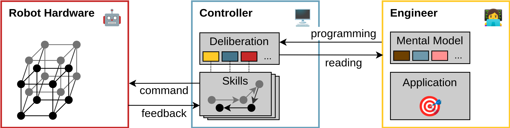

---
date:
  created: 2025-05-30
tags:
  - behavior-trees
  - deliberation
  - software-engineering
  - ros
categories:
  - Thinkoneering
---

# How Does One Even Program a Robot? (working title)

A robot is characterized primarily by it's versatility.
It is a tool that can be used for different tasks in many context that each have there own special challenges.
This makes it inherently hard to program a robot.
Especially, if the resulting robotic system is expected to act autonomously and robustly to unforeseen situations.
<!-- more -->

In industrial automation, a well-established applications of robots, the act of programming usually means defining a fixed sequence of motions that the robotic arm then executes time and time again.
When we instead think of a robot acting in a less structured environment like a home, the robot can not blindly follow a predefined sequence of actions.
Because, following these predefined actions will fail as soon as anything in that home changes.
And as everyone living with children knows, changes must always be expected but can never be predicted.

In this article I want to develop an understanding of what it means to program a robot to act autonomously.
And I hope that with that understanding it will be easier to see what may be missing in order to build genuinely autonomous machines.
Like with many questions, AI is something that comes to mind as an answer.
But at least for now, I am assuming a human to be involved in building and programming this robot.
Nevertheless, fixing the problems I want to grasp here, will also help AI-based approaches.

I am trying hard to make this article approachable for both, people who don't have a technical understanding of robotics as well as engineers for whom some of the other concepts may feel a bit out there.
I would be curious to learn if this worked.
So please let get in touch and tell me your thoughts on  this topic.

TODO: structure

## Blog Articles that Motivated This

A blog post in particular brought this topic back to my attention.
Benjie Holson's article introduces the important and _mythical non-roboticist_[@holsonMythicalNonRoboticist2024].
This is the person that simple methods to program robots are seemingly designed for, while the underlying problem is hard.
But his point is that this simplification removes aspects from the programming that would have been needed to make the robot work.
And in particular the article highlights two categories:

1. __Environment Complexity__:
  This is what I introduced on top with the messy home.
  You don't know in which exact environment the robot will operate, when you build it.

2. __Stupid Bullshit Complexity__:
  I think this can be called integration.
  Robotic control systems require internal components that are hard to use because they require very specialized configurations and data formats.

But the crucial point with both of these is that it is important to have a clear user in mind.
And if I were to summarize the articles message, I think it is to respect the users intelligence and sanity by designing a way to program a robot that reflects the true complexity of the task to the user (intelligence) without introducing unnecessary complexities that they have to manage (sanity)[@holsonMythicalNonRoboticist2024]. <!-- markdownlint-disable-line no-reversed-links -->

Another article that is less specific to robotics but also looking into how humans interact with code is by Erik Bernhardsson[@bernhardssonItsHardWrite2024].
It explicitly introduces the concept of a mental model that another human reading your code has.
This is something that I will explore below in the context of robotics.
The article then provides valuable and concrete tips in how to design the code that another developer interacts with.
For example the valid suggestion to avoid the need for a mandatory configuration.
Another one is to avoid conceptual overload, something that many robotics projects including our own work on [AS2FM](https://github.com/convince-project/as2fm) could learn a lot from[@bernhardssonItsHardWrite2024].

An interesting article that looks at this problem from a standpoint of theoretical computer science is written by Dirk Riehle[@VisualSpaghettiRobotics2023].
The article points out the need for a differentiation between the definition of a language and it's implementation, when designing a way to program a robot.
Because this way of programming can almost certainly be treated as a language.
And programming languages must have clearly defined semantics[@VisualSpaghettiRobotics2023].

For example the now popular Behavior Trees are missing such a semantic, which is why we proposed one[@ghiorziExecutionSemanticsBehavior2025].
This general field of formalisms that allow to define the autonomous behavior of a robot can be called _Robotic Deliberation_.
And I started my talk at ROSCon 2023 with comparing it's relevance with that of the invention of programming languages by Grace Hopper[@roboticsSupportingRoboticDeliberation2023].
While this may be thought provoking, it is also rather handwavy.
In this article I will try to make it more concrete.
But to achieve that, I think it is necessary to introduce some more background on the theoretical side.

## Thinking about Systems

A concept that I think is very important here is _complexity_.
This term is used very broadly and we have even seen it in this article before.
Especially for computer scientists it has to be said that we are not talking about computational complexity.
Instead, I want to start with and example from the _complex systems theory_:

> [...] a system that is complex, in the sense that a great many independent agents are interacting with each other in a great many ways. Think of the quadrillions of chemically reacting proteins, lipids, and nucleic acids that make up a living cell, or the billions of interconnected neurons that make up the brain, or the millions of mutually interdependent individuals who make up a human society.[@waldropComplexityEmergingScience1993]

Where I think the comparison between chemicals, neurons, individuals all the way to society is particularly relevant.
It becomes clear that complexity can only be understood as a difference.
This difference can be best understood if one carefully thinks about the implications of a statement like _"To build a house, you don't need to know quantum physics"_.
This hints at one of my favorite topics, that is _emergence_.
But for now, all we have to know about complexity is that it is relative.
An crucially, inside of a system it is smaller than outside:

> The system does not have the capacity to connect a state of its own to everything that happens in the environment and to juxtapose one of its own operations to every environmental occurrence, in order either to enhance or to curtail what is happening. Instead, the system has to bundle and even ignore occurrences, and it must deploy indifference or create special arrangements for the management of complexity.[@luhmannIntroductionSystemsTheory2013]

For a definition of _system_, it should be sufficient in this context to think of a finite collection of items including some relations between them.
This is somewhat aligned with a common-sense definition of technical systems.
Crucially, all systems have an environment, which is simply everything that is not part of the system.

For example a language is a system containing all words or symbols that can be used including some relation between them, usually referred to as syntax.
Semantics is what we would consider the relation of the language to some parts of its environment.
But also in that environment are all the words of other languages.
If we think about programming languages, there may be changes when new language versions are announced.
This then changes the language system by considering things that previously were part of the environment to belong to it, now.
Human languages can also add to their system, for example when a new word is taken up by the society of it's speakers.
New words are often variants of words already present in other languages.
For the general way how systems create themselves with respect to their environment, the Chilean biologists Maturana and Valera coined the beautiful term _autopoiesis_[@maturanaAutopoiesisCognitionRealization1980].

Generally, I find it helpful for engineers that are constantly thinking about systems of some sort to have a clearer understanding of what this means.
Here, it is crucial that every _way_ to consider a system is just one arbitrary _way_ to look at the world.
For example going back to robotics, it is in now way set in stone what we should consider the system and what the environment.
Simply, because there are many, in fact infinite possible choices.
The most natural one is obviously to look for example at a mobile robot and consider all the physical hardware that moves with it to be the robotic system.
And, by difference this then also defines all the rest as it's environment.
That includes the surface it moves on, obstacle it may encounter, the outside world, and including even you, the programmer sitting next to it with your laptop.
But I always thought it could be a better way to think of the computer device controlling the robot as the main system, when programming it.
Because then, sensors and actuators are part of the environment and this mental model makes it way easier to consider inaccuracies in perception and the necessity to recover from wrong movements.

## Building an Understanding of Programming a Robot

For a start we can think of robot programming in terms of dimensionality reduction.
A humanoid robot for example has large number of actuators and every possible configuration of these can be thought of as a point in a high-dimensional space.
If I now want to tell the robot to move to a location on the two-dimensional floor of my flat or pick up an object in the three-dimensional space, this is clearly a reduction.

But it is of course more than that.
Because the robot can not magically take up any of these configurations, we can not stop at considering points but linked points, because only these are possible movements.
The way of programming the robot must also adhere to these constraints.
Additionally, programming will add the aspect of time.
It will command the robot to be in a given configuration at a given time.
A sequence of timed configurations is what we would consider a trajectory.

This is pretty much how a industrial robotic arm is programmed.
There are additional aspects, like labeling given configurations to make them recognizable, logic relations to other hardware, planning of trajectories between these configurations like [moveit](https://github.com/moveit/moveit2) does it in ROS.
On top of these aspects, the programming also considers limitations of the hardware.
For example restricting the angle a joint can move to in order not to damage the robot itself.

Relating this to the introduced concept of complexity, it is clear how the programming reduces complexity.
The relative complexity in the system of the controller is lower compared to the actual robotic hardware and what it could do.
And this is effective at enabling robot programmers to make the robot repeat predefined motions.
Some more challenging things are possible, like reacting to sensor input to avoid obstacle in the way of the robot or changing the actual goal of the motion based on the perceived location of an object.
But these approaches will fail for any scenario that provides less structure like outdoor environments or my house if I am honest.
These scenarios require _autonomy_.

## Autonomy with Skills

I would define a system as _autonomous_ if it can make decisions towards a goal even if these decisions where not explicitly anticipated in the programming.
Developing a robot to react to some conditions at runtime would definitely be feasible with what is described above.
But crucially, it would be very complex solutions.
These solutions must contain some mapping between a recognized situation and what the robot should do in these cases.
Think of a long list of conditions and actions.

How can we make this list shorter?
By reducing the complexity further.
To make it simpler to program the robot, we need to reduce the necessary complexity in the system or language that programs the robot.
For example with a humanoid robot, our language should definitely not have to worry about the robot falling over, damaging others or itself.
This is not what a programmer trying to tell the robot to get an apple from the kitchen should every worry about.

This is generally achieved by skill-based architectures.
The controller must have blocks that are called skills which solve some functionalities without explicitly programming them.
For example one skill will handle the complete movement of the robot.
Then the act of programming only entails sending for example the goal location the robot should move to.
The component that uses or orchestrates these skills towards a desired goal, is the _deliberation_ layer, we talked about above.
These or similar architectures could be considered state-of-the-art in more complex robotic systems[@rovidaSkiROSSkillBasedRobot2017].

If we compare this to the mythical non-roboticist article[@holsonMythicalNonRoboticist2024] and the two complexities, environment complexity and stupid bullshit complexity.
Skills work towards addressing then environment complexity, for example by handling the navigation to a given goal.
The reduction of stupid bullshit complexity can be even seen as the primary motivation to introduce skill-based architecture in the first place.
So, assuming a perfectly designed skill-based architecture, this type of complexity should be reduced to zero in the deliberation layer.

But, caution is necessary on the type of this complexity reduction.
A design goal for a skill-based architecture must definitely be elimination of unnecessary complexity.
And herein lies the challenge.
How on earth should we know what may be necessary in this deliberation layer?
We expect it to be useful for any possible type of application and it should even handle conditions that a programmer can not anticipate when programming.
But we have to start somewhere.
And I think we should start at the beginning of everything: the almighty creator - _the engineer_.

## Who programs it?

If we want to make sure that someone can program a robot as easily as possible, we have to elaborate which factors influence the ease of programming.
Here, I want to look again into the idea of a mental model.

Engineers building robots are generally considered- to be smart people, because they deal with complicated systems.
People that are also generally considered to be smart are chess players.
There exists a very interesting body of research evaluating what it is about the minds of professional chess players that determines there success at chess.
One may assume that people who are good at chess can simply think more logically or understand more complex systems in there mind.
But, the situation is different:

> By measuring the time intervals between placements of successive pieces when the subjects attempted to reconstruct the positions, we were able to identify the boundaries of perceptual chunks. The data suggest that the superior performance of stronger players (which does not appear in random positions) derives from the ability of those players to encode the position into larger perceptual chunks, each consisting of a familiar sub-configuration of pieces. Pieces within a single chunk are bound by relations of mutual defense, proximity, attack over small distances, and common color and type.[@chasePerceptionChess1973]

Their results suggest that the success of a chess player is related to the size of the chunks they use to store chess boards in their memory.
And the ability to retain these chess board configurations in memory is only present for configurations from actual games, not when the pieces are placed on the board randomly.
This mental model is aided by the actual role each piece plays in a given real configuration.
Because these players built these models by actually playing chess.
And their success is now not simply determined by how many hours they played but whether they managed to produce a highly effective mental model to quickly recognize and evaluate future board configurations.

To quote one of my favorite books of all time:

> Learning high-level chess can be compared to learning to read. A first grader works hard at recognizing individual letters and assembling them into syllables and words, but a good adult reader perceives entire clauses. An expert reader has also acquired the ability to assemble familiar elements in a new pattern and can quickly “recognize” and correctly pronounce a word that she has never seen before. In chess, recurrent patterns of interacting pieces play the role of letters, and a chess position is a long word or a sentence.[@kahnemanThinkingFastSlow2011]

But what does this have to do with programming robots?
I think, the success of building complex autonomous robots is also determined by the quality of the programmers mental model.
If we want to make the programming of robots simple, we can not have the programmer invest hours and hours learning to _read_ pieces of robotics applications.
Instead, we must make sure that the language that defines the robotic deliberation facilitates a mental model.
Everyone learning a foreign language know that this is no easy task, but that there are definitely easier and harder languages one could choose from.

## What is missing?

This brings me finally to my summary of what I think is needed to ...

- language for humans

- write: expressive
- read: interpretable
- think: predictable

-> mental model!

- AI: i think is also missing the middle bit. the expressive language
- llm technically work on a language level. but if we are missing a language that could really program robots, how could an llm do this?

<!-- Abbreviations -->

*[AI]: Artificial Intelligence
*[ROS]: Robot Operating System
